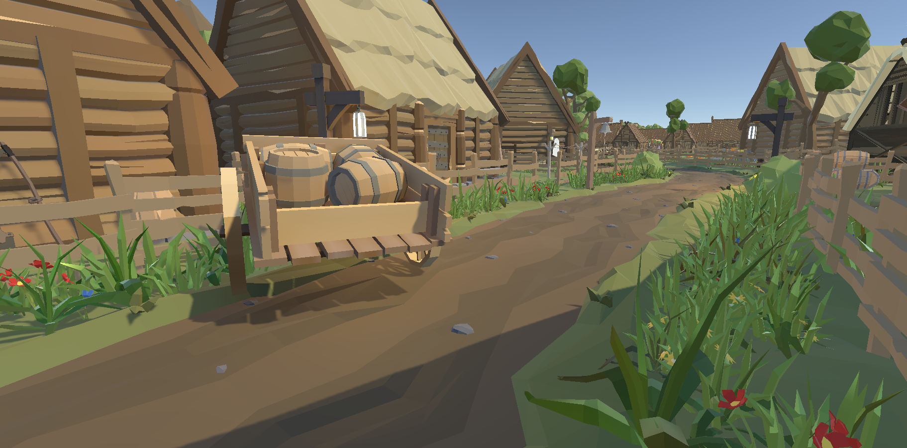
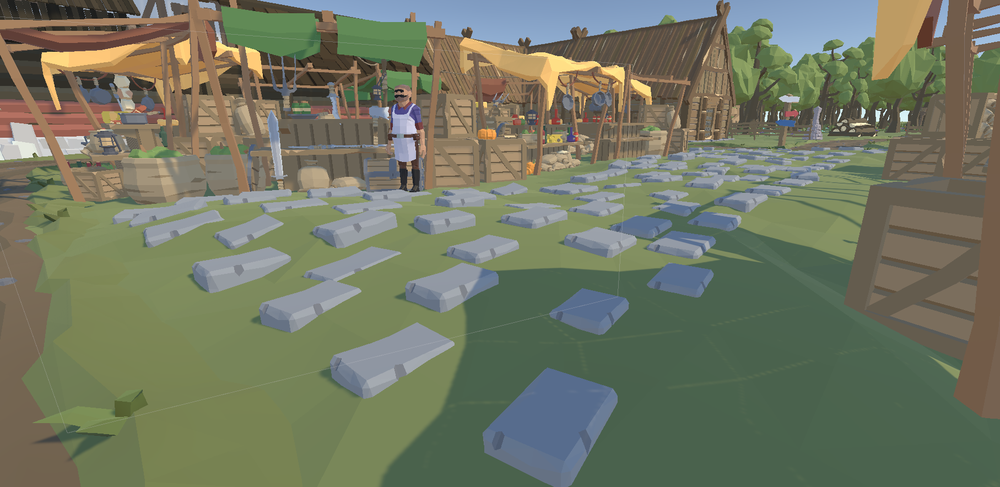
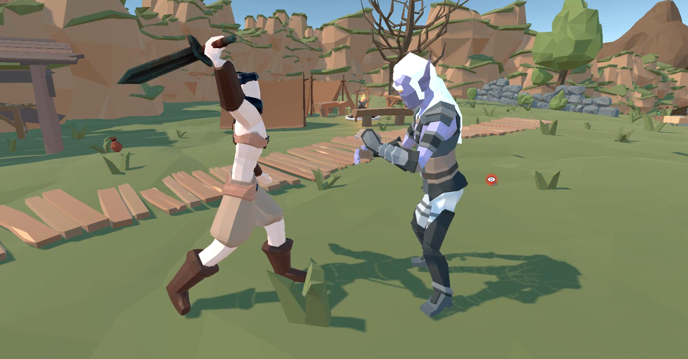
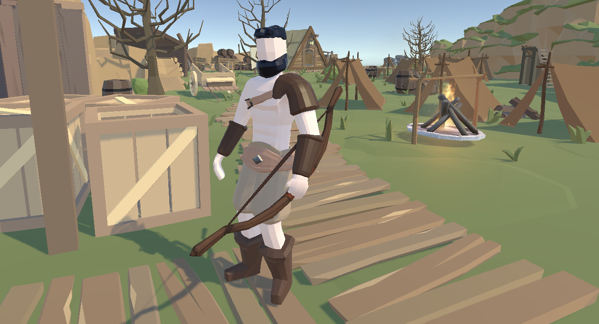
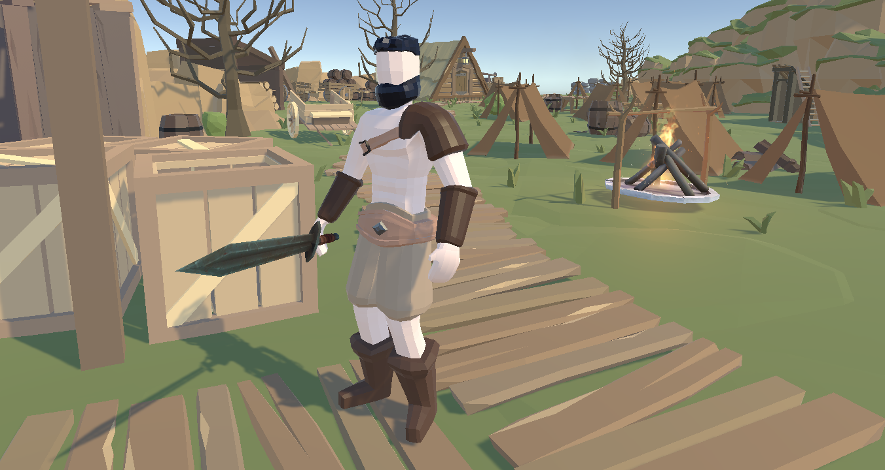
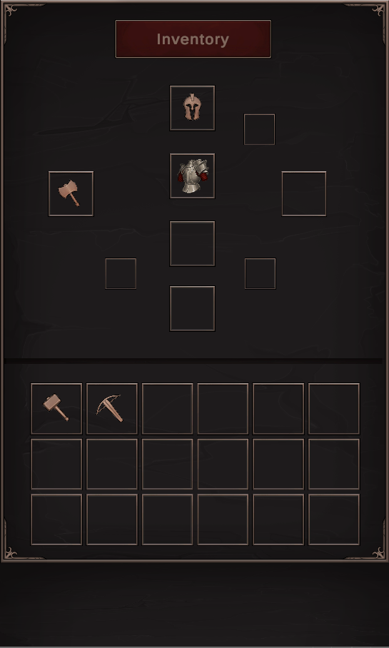

# The-Blood-Calls
by Nicolae Davidov

Hello there, my name is Nicolae Davidov and I'm a third year student at **University of Sussex** studying **(BSc) Games and Multimedia Environment**. I've created a few projects along the way in my university life (some alright some awful). Currently I'm working on my **dissertation** which is a fast paced ARPG/Hack and Slash game in **Unity**.

## Story
You will be playing as the main character Goraan, his is on a hunting trip and has't been home in a few days. Your task is to find him, search every village and cave to bring him back home.

Here are some pictures:

1. Town 1

1. Town 2

1. Combat

1. Weapon Change

1. Weapon Change 2

3. Inventory UI

## Gameplay

Here are a few seconds of some very **early stage** gameplay

https://user-images.githubusercontent.com/64851435/111297458-8d837480-8645-11eb-8d6d-fd3ba3d1427d.mp4

## Development

This game is still in it's **early stages**, there will be much more content added such as:
1. Shop keeper & currency
2. Ability powers
3. Spawn points
4. Many different weapons
5. Lots of enemies

### Contact
You can find me here for any reason.

https://www.linkedin.com/in/nicolae-davidov-8b45aa1b0

### Thank you for taking the time to be here!
